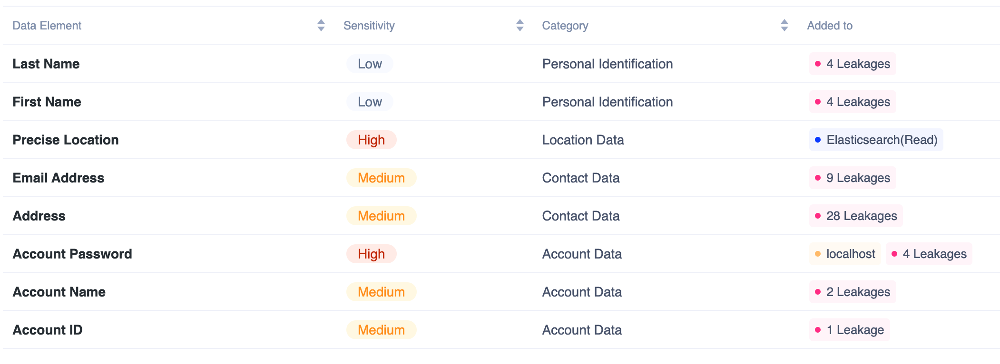

# Understanding Results

When a scan is complete, by default a local result file (`<source directory>/.privado/privado.json`) is generated. This result file contains details of what all Privado found while scanning your code - this includes data elements, data flows, inventory of 3rd party sinks etc. To know more about what is inside `privado.json` head to [this section.](understanding-the-results.md#privado.json)

## Privado Dashboard

When configured, results can also be directly shown o the Privado’s cloud dashboard for better analysis. Let’s see what all we can see in the dashboard.

## Data Elements

These are personal data elements that are being collected, processed, or shared in the code.

## Data Flow Diagrams

They show detailed usage of any particular data element, making it easier to understand data flows and identify privacy and security risks.

.png>)

## Data Inventory

These are either third parties where the data is being shared for processing or databases where it is being stored.

.png>)

## Code Analysis

For developers, it also generates a line-by-line flow of the data element for easy identification of the detected flow.

.png>)

## Issues

Privacy and data security threats, and compliance policy violations result into issues. Threat issues can be directly mitigated by applying the code fix. Example: Email and Date of Birth are logged as plain text in the log file. The guidance is provided to developers on how to fix the issues. The compliance issues are result of the governing policies such as no application can access credit card data except “payment” micro-service.

Check out some of our blogs on how these issues can sometimes lead to big problems. (links to case studies on data leaks)

.png>)

## privado.json

With all the results neatly compiled in a JSON file, it enables developers to extract other useful information from the code scan to create their own analysis. The resulting privado.json file looks something like this,

<figure><figcaption></figcaption></figure>
